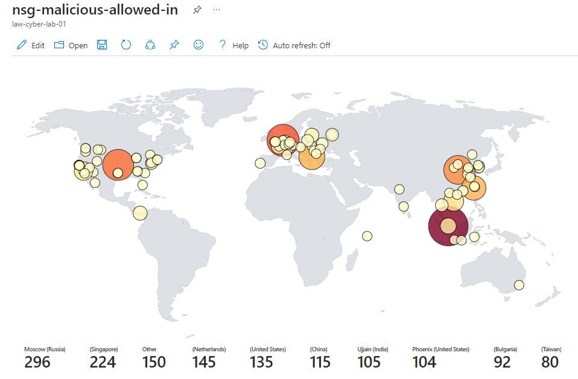
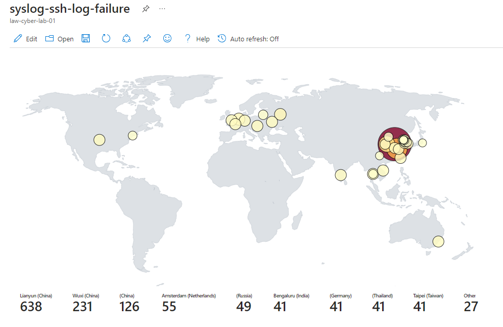
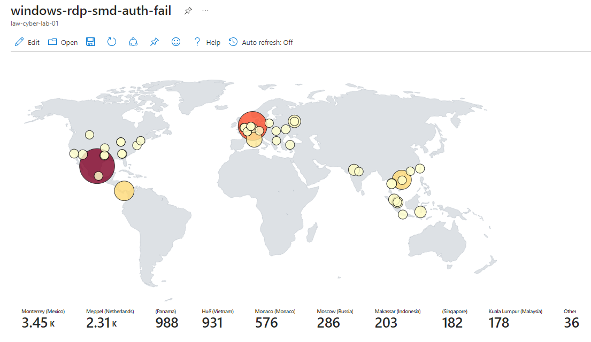
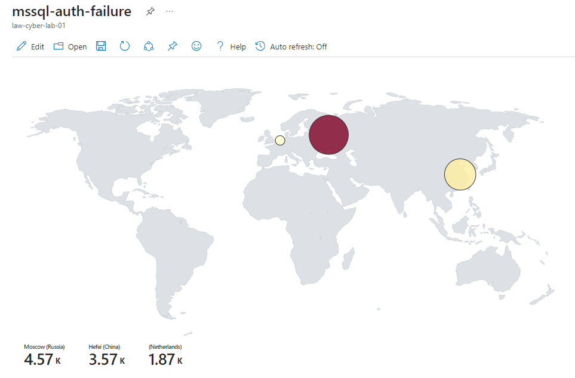
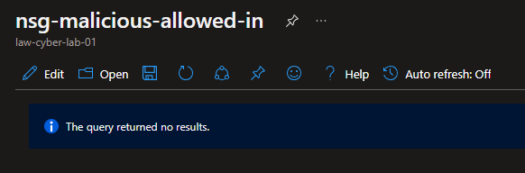
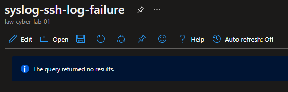
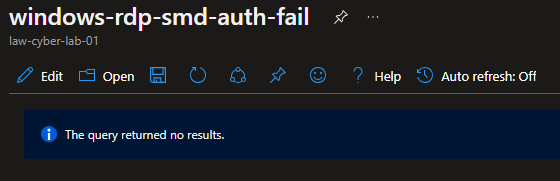
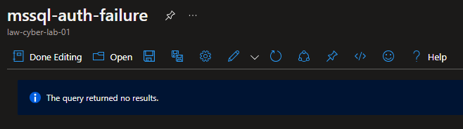

# Building a SOC + Honeynet in Azure (w/Live Traffic)

Note: This is a general overview. For a more in-depth (read: lengthy) walkthrough of the process, check my [Field Notes](https://iruldanet.gitlab.io/field-notes/azure-soc-honeynet/). 

<!-- Insert Project Image -->

## Introduction

In this project, I build a small-scale honeynet in Azure. I utilized Log Analytics to ingest logs from various sources that Microsoft Sentinel would leverage to build attack maps, trigger alerts, and create incidents. I configured log collection on the insecure environment, set security metrics then observed the environment for 24 hours. After investigating the incidents that Microsoft Sentinel generated during that period, security controls were applied to address the incidents and harden the environment. A second 24-hour observation was conducted to collect new data on the security metrics post-remediation. The collected metrics were:

- SecurityEvent (Windows Event Logs)
- Syslog (Linux Event Logs)
- SecurityAlert (Log Analytics Alerts Triggered)
- SecurityIncident (Incidents created by Sentinel)
- AzureNetworkAnalytics_CL (Malicious Flows allowed into our honeynet)

<!-- ## Architecture Before Hardening / Security Controls
 --> 

The architecture of the mini honeynet in Azure consists of the following tools and components:

- Virtual Network (VNet)
- Network Security Group (NSG)
- Virtual Machines (2 Windows, 1 Linux)
- Azure Key Vault
- Azure Storage Account
- Microsoft SQL Server
- SQL Server Management Studio (SSMS)
- PowerShell

Additionally, the SOC utilized the following tools, components and regulations: 
- Microsoft Sentinel (SIEM)
- Microsoft Defender for Cloud
  - [NIST SP 800-53 Revision 4](https://csrc.nist.gov/publications/detail/sp/800-53/rev-4/archive/2015-01-22)
  - [PCI DSS 3.2.1](https://listings.pcisecuritystandards.org/documents/PCI_DSS-QRG-v3_2_1.pdf) 
- Log Analytics Workspace
- Windows Event Viewer
- Kusto Query Language (KQL)

To collect the metrics for the insecure environment, all resources were originally deployed, exposed to the  public internet. The Virtual Machines had their Network Security Groups open (allowing all traffic) and built-in firewalls disabled. All other resources were deployed with endpoints visible to the public Internet.

### Implementing Security Controls

To collect the metrics for the secured environment, Network Security Groups were hardened by blocking ALL traffic (with the exception of my workstation), and built-in firewalls enabled. Azure Key Vault and Storage Container were protected by disabling access to public endpoints and replacing them with rivate endpoints.

## Attack Maps Before Hardening / Security 

### NSG Allowed Malicious Inbound Flows
<br>

### Linux SSH Authentication Failures
<br>

### Windows RDP/SMB Authentication Failures
<br>

### MS SQL Server Authentication Failures
<br>

## Metrics Before Hardening / Security Controls

The following table shows the metrics we measured in our insecure environment for 24 hours: <br>
Start Time	2023-07-09 22:23:51 <br>
Stop Time	2023-07-10 22:23:51

| Metric                   | Count
| ------------------------ | -----
| SecurityEvents           | 131638
| Syslog                   | 4847
| SecurityAlert            | 6
| SecurityIncident         | 359
| AzureNetworkAnalytics_CL | 2450

<!-- ## Architecture After Hardening / Security Controls
 --> 

<!-- ## Architecture After Hardening / Security Controls
 --> 


## Attack Maps After Hardening / Security Controls

```All map queries returned no results due to no instances of malicious activity for the 24-hour period after hardening.```

### NSG Allowed Malicious Inbound Flows
<br>

### Linux SSH Authentication Failures
<br>

### Windows RDP/SMB Authentication Failures
<br>

### MS SQL Server Authentication Failures
<br>

## Metrics After Hardening 

The following table shows the measurements taken after applying the security controls the environment and observing for another 24 hours: <br />
2023-07-11 22:15<br />
2023-07-12 22:15

| Metric                   | Count
| ------------------------ | -----
| SecurityEvent            | 22668
| Syslog                   | 24
| SecurityAlert            | 0
| SecurityIncident         | 0
| AzureNetworkAnalytics_CL | 0

### Impact of Security Controls 

| Metric                                       | Change post-hardening
| -------------------------------------------- | -----
| SecurityEvent (Windows VMs)                  | 82.78%
| Syslog (Linux Vms)                           | 99.50%
| SecurityAlert (Microsoft Defender for Cloud) | 100%
| SecurityIncident (Sentinel Incidents)        | 100%
| AzureNetworkAnalytics_CL                     | 100%

## Conclusion

In this project, a mini honeynet was constructed in Microsoft Azure utilizing Log Analytics with Microsoft Sentinel. Sentinel used logs ingested by a Log Analytics workspace to trigger alerts and create incidents. Next, logging was enabled and data collected on the insecure environment based on established security metrics, before applying security controls. The logs and data were reassessed after implementing security measures. As a result, the number of security events and incidents were drastically reduced after the security controls were applied. 

It is worth noting that if the resources within the network were heavily utilized by regular users, it is likely that more security events and alerts may have been generated within the 24-hour period following the implementation of the security controls.


